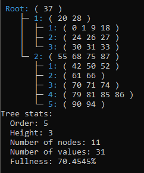

# B-Treezy

Project for my ALG2 course

## Description 

A simple implementation of a B-Tree data structure. The aim of this project is to learn how this data structure works and to implement it in C++ as a console application.

## Features

- B-Tree implementation: Provides a complete implementation of a B-Tree data structure.
- Insertion and deletion: Allows insertion and deletion of nodes in the B-Tree.
- Searching: Enables searching for specific keys in the B-Tree.
- Visualization: Provides a simple console visual representation of the B-Tree structure.
- Customizable order: Allows customization of the B-Tree order.

### Visualization example



## Usage

### Creation
```cpp
// create a new tree and set its order
BTree* tree = new BTree(3);
```

### Printing
```cpp
// print basic information about the tree
tree->PrintInfo();

// print current statistics about the tree
tree->PrintStats();

// print the contents of the tree
tree->Print();
```

### Operations
```cpp
// each operation has a print and non-print variant

// insert a node into the tree
tree->InsertPrint(5);

// find a node within the tree
tree->FindPrint(5);

// remove a node from the tree
tree->RemovePrint(5);
```

## TODO

- Some sort of CLI (so far the project includes only the implementation and API).
- Templated B-Tree (I learned about templates after finishing this project).

> Originally made in December 2022
